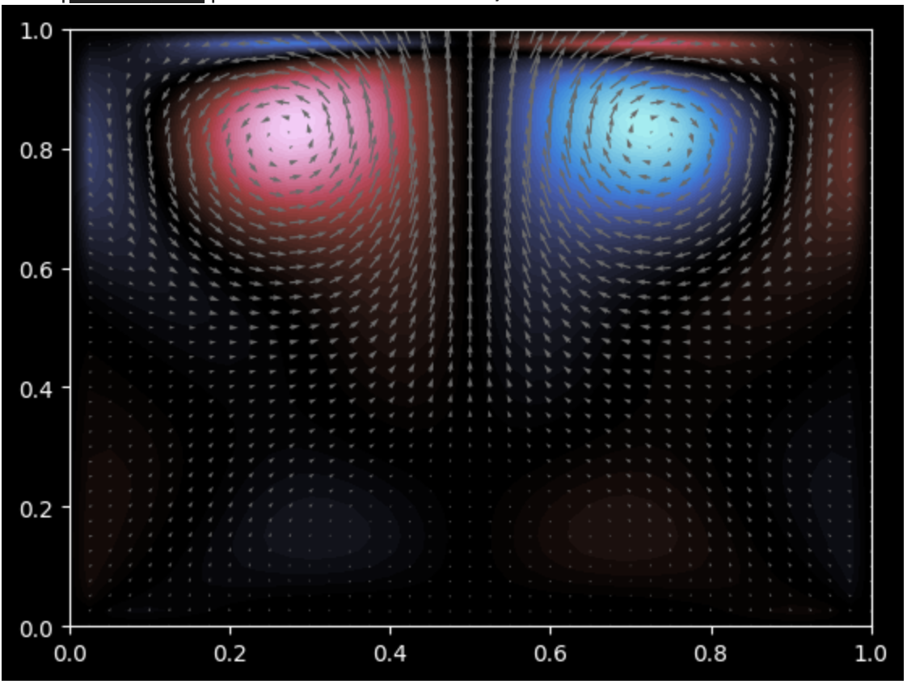
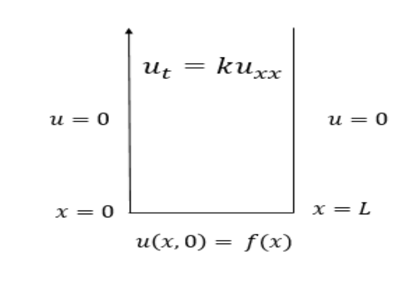

# Stable Fluid Simulation

  

Solution to the Incompressible Navier Stokes equations using "Stable Fluids" method proposed by Jam Stam in a closed box with a forcing that creates a bloom. 

# Method
Section describes the equations and method used to write up the simulation. 

## basic equations

The solution is based off Navier Stokes Equation particularly:

$$\frac{\partial u}{\partial t} + (u \cdot \nabla)u = \frac{-1}{\rho} \cdot \nabla \rho + \nu \cdot \nabla^{2}u + f $$

Incompressibility Equation in the simulation is based on:

$$\nabla \cdot u = 0 $$ 

where:
 - u: Velocity (assumed to be a 2D vector)
 - p: pressure
 - f: Forcing
 - $\rho$: Density 
 - $\nu$: Kinematic Viscosity 
 - t: Time
 - $\nabla$: Nonlinear Convection as well as divergence and gradient
 - $\nabla^{2}$: Laplace Operator 

 The box will start the simulation as a Homogenuous Dirichlet Boundary Condition as seen below : 

  

The *forcing* function, is an upwards force in the lower center of the domain (ie., relative to the box above). 

## solution

1) The simulation starts with zero velocity across the entire grid, so $u$ will be set as $u=[0, 0]$. 

2) The sim then adds forces through euler stepping (only one in our sim):

$$w_{1} = u + \Delta t \cdot f$$

3) Convection is done through self-advection. It is essentially a process of setting the value at the current location to be the balue at the position previously (i.e., backtracked) on the streamline placed.

$$w_{2} = w_{1}(p(x, -\Delta t)) $$

4) We then diffuse implicitly by solving a linear system matrix-free. This is done by using Conjugate Gradient, which may be unconditionally stable, but works for the stake of sim:

$$ (I - \nu \cdot \Delta t \cdot \nabla^{2})\cdot w_{3} = w_{2}$$

5) This step is realtively straightforward, but is broken down into multiple steps:
- a) The simulation starts this step off by computing a pressure correction by solving a linear system matrix-free also with a Conjugate Gradient and the use of *Poisson Operator*:

$$\nabla^{2} \cdot \rho = \nabla \cdot w_{3}$$

- b) The velocities then get corrected to be incompressible: 

$$w_{4} = w_{3} - \nabla \rho$$

6) The simulation advances to the next iteration of the solution by updating $u$ to:

$$u=w_{4}$$

